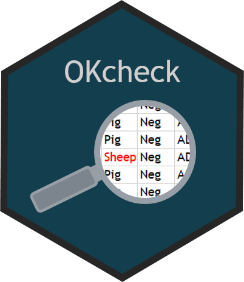

# OKcheck: Tools to facilitate checking of data from National Surveillance Programmes 

<!-- README.md is generated from README.Rmd. Please edit that file -->

-   [Overview](#overview)
-   [Installation](#installation)
-   [Usage](#usage)
-   [Copyright and license](#copyright-and-license)
-   [Contributing](#contributing)

## Overview

`OKcheck`provide tools to facilitate checking of data from national
surveillance programmes.

`OKcheck` is part of `NVIverse`, a collection of R-packages with tools
to facilitate data management and data reporting at the Norwegian
Veterinary Institute (NVI). The `NVIverse` consists of the following
packages: `NVIconfig`, `NVIdb`, `NVIpjsr`, `NVIspatial`, `NVIpretty`,
`NVIbatch`, `OKplan`, `OKcheck`, `NVIcheckmate`, `NVIpackager`,
`NVIrpackages`. See [Contribute to
OKcheck](https://github.com/NorwegianVeterinaryInstitute/OKcheck/blob/main/CONTRIBUTING.md)
for more information.

## Installation

`OKcheck` is available at
[GitHub](https://github.com/NorwegianVeterinaryInstitute). To install
`OKcheck` you will need:

-   R version &gt; 4.1.0
-   R package `remotes`
-   Rtools version 4.0, 4.2, 4.3 or 4.4 depending on R version

First install and attach the `remotes` package.

    install.packages("remotes")
    library(remotes)

To install (or update) the `OKcheck` package without vignettes, run the
following code:

    remotes::install_github("NorwegianVeterinaryInstitute/OKcheck",
        upgrade = FALSE,
        build = TRUE,
        build_vignettes = FALSE)

To install (or update) the `OKcheck` package with vignettes, you will
need to first install some additional R-packages needed to build the
vignettes. Check README below in the section [Vignettes](#vignettes) to
see which vignettes are available. To install the package with the
vignettes, first install the packages: `knitr`, `rmarkdown`, `R.rsp`,
and `NVIrpackages` (from GitHub) if they are missing. If you don’t use
R-studio, you will also need to install Pandoc. Then run the following
code:

    remotes::install_github("NorwegianVeterinaryInstitute/OKcheck",
        upgrade = FALSE,
        build = TRUE,
        build_vignettes = TRUE)

## Usage

The `OKcheck` package needs to be attached.

    library(OKcheck)

`OKcheck`provide tools to facilitate checking of data from national
surveillance programmes.

#### Further documentation

##### Help

The full list of all available functions and datasets can be accessed by
typing

    help(package = "OKcheck")

##### Vignettes

Consult the vignettes for task-oriented help.

    vignette(package = "OKcheck")

Vignettes in package `OKcheck`:

-   Contribute to OKcheck (html)

##### NEWS

Please check the
[NEWS](https://github.com/NorwegianVeterinaryInstitute/OKcheck/blob/main/NEWS)
for information on new features, bug fixes and other changes.

## Copyright and license

Copyright (c) 2022 - 2024 Norwegian Veterinary Institute.  
Licensed under the BSD\_3\_clause License. See
[License](https://github.com/NorwegianVeterinaryInstitute/OKcheck/blob/main/LICENSE)
for details.

## Contributing

Contributions to develop `OKcheck` is highly appreciated. There are
several ways you can contribute to this project: ask a question, propose
an idea, report a bug, improve the documentation, or contribute code.
See [Contribute to
OKcheck](https://github.com/NorwegianVeterinaryInstitute/OKcheck/blob/main/CONTRIBUTING.md)
for more information.

## <!-- Code of conduct -->

Please note that the OKcheck project is released with a [Contributor
Code of
Conduct](https://github.com/NorwegianVeterinaryInstitute/OKcheck/blob/main/CODE_OF_CONDUCT.md).
By contributing to this project, you agree to abide by its terms.
